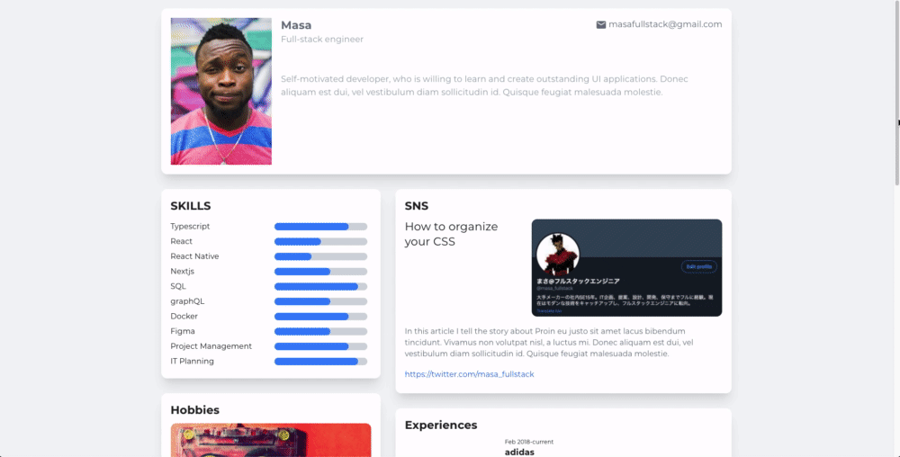

<!-- Please update value in the {}  -->

<h1 align="center">Portfolio</h1>

<div align="center">
   Solution for a challenge from  <a href="http://devchallenges.io" target="_blank">Devchallenges.io</a>.
</div>

<div align="center">
  <h3>
    <a href="images/demo.gif">
      Demo
    </a>
    <span> | </span>
    <a href="https://portfolio-one-lyart.vercel.app/">
      Solution
    </a>
    <span> | </span>
    <a href="https://devchallenges.io/challenges/5ZnOYsSXM24JWnCsNFlt">
      Challenge
    </a>
  </h3>
</div>

<!-- TABLE OF CONTENTS -->

## Table of Contents

- [Overview](#overview)
  - [Built With](#built-with)
- [Features](#features)
- [How to use](#how-to-use)
- [Contact](#contact)
- [Acknowledgements](#acknowledgements)

<!-- OVERVIEW -->

## Overview



Developed with NextJS + Contentful(Headless CMS).
For the NextJS template, we used the NextJS Typescript Boilerplate from the official examples.
In NextJS, HTML was created with SSG, and in the portfolio display area, pagenation and tag filter were realized with CSR.
CSR used the useReducer in React Hooks.
For CSS, we used Tailwindcss.
During development, we used docker-compose to build the development environment.
(I could have used "vercel dev", but I wanted to learn docker.)

When updating the content, it is possible to maintain it by simply updating the content with Contentful.

Thanks for viewing :)

### Built With

<!-- This section should list any major frameworks that you built your project using. Here are a few examples.-->

- [NextJS](https://nextjs.org/)
- [NextJS Typescript Boilerplate](https://github.com/vercel/next.js/tree/master/examples/with-typescript-eslint-jest)
- [React](https://reactjs.org/)
- [TypeScript](https://www.typescriptlang.org/)
- [Tailwindcss](https://tailwindcss.com/)
- [Contentful](https://www.contentful.com/)
- [Docker](https://www.docker.com/)

## Features

<!-- List the features of your application or follow the template. Don't share the figma file here :) -->

This application/site was created as a submission to a [DevChallenges](https://devchallenges.io/challenges) challenge. The [challenge](https://devchallenges.io/challenges/5ZnOYsSXM24JWnCsNFlt) was to build an application to complete the given user stories.

## How To Use

<!-- Example: -->

To clone and run this application, you'll need [Git](https://git-scm.com) and [Node.js](https://nodejs.org/en/download/) (which comes with [npm](http://npmjs.com)) and [Docker](https://www.docker.com/) installed on your computer. From your command line:

```bash
# Clone this repository
$ git clone https://github.com/masa-fullstack/portfolio

# Clone this repository
$ docker-compose up

# Install dependencies
$ docker-compose exec yarn install

```

## Acknowledgements

<!-- This section should list any articles or add-ons/plugins that helps you to complete the project. This is optional but it will help you in the future. For example -->

Each official website listed in Built With

- [Tailwind CHEAT SHEET](https://nerdcave.com/tailwind-cheat-sheet)

## Contact

- GitHub [@masa-fullstack](https://github.com/masa-fullstack)
- Twitter [@masa_fullstack](https://twitter.com/masa_fullstack)
